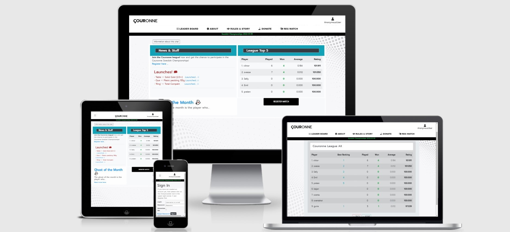
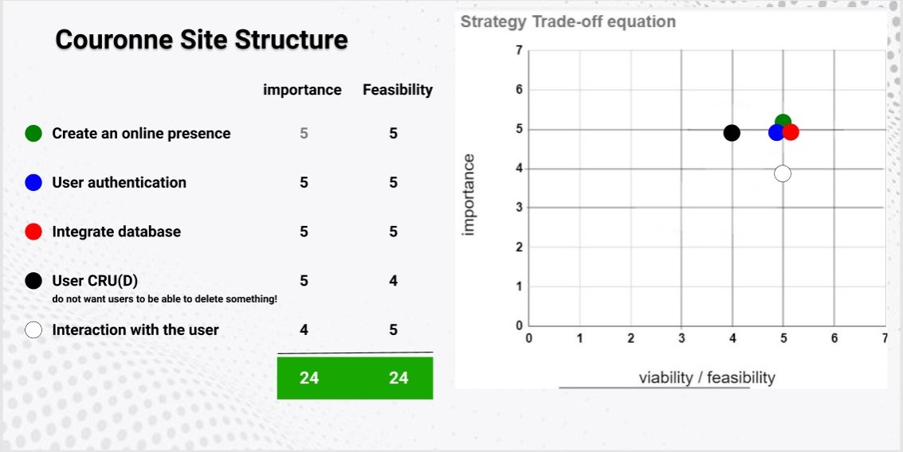
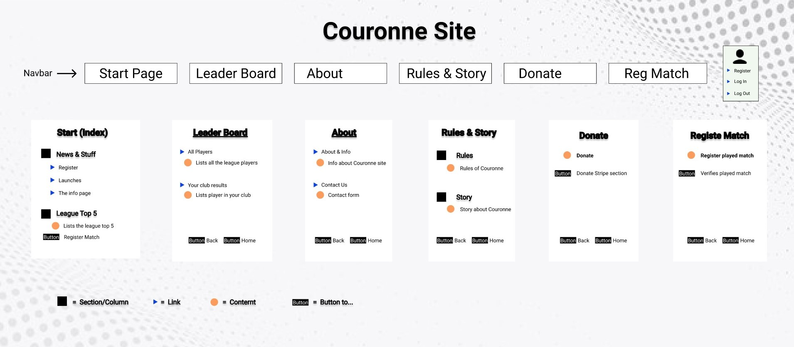
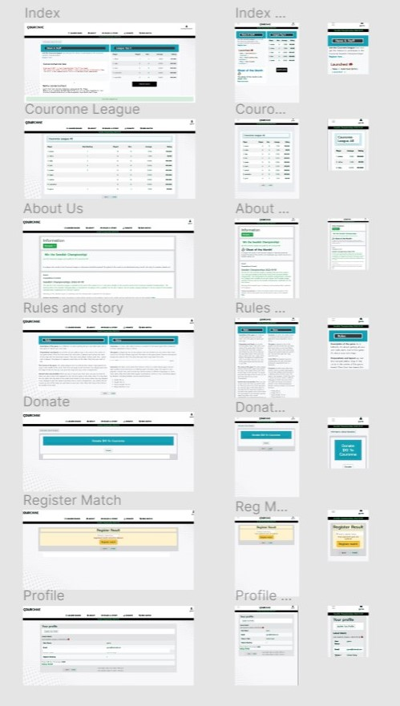

# Couronne
### A site where you can record matches played against your friends. And Couronne takes care of the rest.



## Project Milestone 4 (Code Institute)

This is a medium advanced website that has most of the features needed to make the website feel comfortable and easy to navigate.

**[View the Couronne repository on GitHub](https://github.com/manell0/couronne)**

**[View The Couronne site on Heroku](https://manello-couronne.herokuapp.com/)**

---

### Overall about the site:

This site uses Amazon Web Services (AWS) to store static files. Stripe for webhooks, payment events and payment. Postgres for database storage and Heroku for distribution.

This site uses both FBV and CBV as it is the best solution. 
The app home uses FBV because I use the mini project Boutique Ado as a basis for my start of programming for this site, and FBV is all I learned (have done some small projects for testing with CBV). 
CBV is used in my other app (donate) and it is largely copied from stripe programming recommendations. 

All functions in the apps work as they should, but some code in the home app is not so "nice" and probably not completely DRY. 
But as Linus Torvalds (author of the operating system core Linux.) Said, if the code works, let it be, we will fix it when we have a lot of time left over and the project is published and finished ...

---

- For testing, please use the following login information for admin privileged pages 
   - Username: admin/Password: code-institute

- For regular users. Just register an account and
   register some matches aginst a registred players, see registated players here: 
      
   https://manello-couronne.herokuapp.com/league_all/

- Or try the user: sally

   who leads the league and is a member of Venue/Club: Couronne Killers, on this page you can see players/friends who are members of the same club like yourself!

      
   - Username: sally/Password: sally

# Introduction

- This pretty solid old-style site that has taken its simple little old-fashioned solid style-design ideas from sites like, [**Django-Admin**](https://manello-couronne.herokuapp.com/admin/), [**Wikipedia**](https://sv.wikipedia.org/wiki/Linus_Torvalds), 
[**Github**](https://github.com/manell0/couronne),
[**flyordie**](http://www.flyordie.com/)

 - It is primarily intended for users who like couronne. But now wants to step up and be able to register their game against their friends in a simple and fun way.

 - In the future intended for everyone. Because the site is easy to upgrade/change. The site is built to be easy to expand.

- The focus of the website is to create an easy way to reach people who want to compete against each other in the classic Swedish table game, Couronne. 
- Easily navigate the site. Good easy-to-understand functions, be a pleasant experience for the visitor.


- The simplicity and small scale of the website is an important aspect to achieve an interest in being on and interest and curiosity to explore more. And finally bookmark the site.

- If you like simple, solid and easy to navigate sites. Like to play matches against your friends, so here you have a site to enjoy.

- This is the fourth of four Milestone projects that the developer must complete during his Full-Stack web development program at The Code Institute.

---

## Mandatory Requirements:
### A project violating any of these requirements will FAIL

1. Django Full Stack Project: Build a Django project backend by a relational database to create a website that allows users to store and manipulate data records about a particular domain.
2. Multiple Apps: The project must be a brand new Django project, composed of multiple apps (an app for each potentially reusable component in your project).
3. Data Modeling: Put some effort into designing a relational database schema well-suited for your domain. Make sure to put some thought into the relationships between entities. Create at least 2 custom django models beyond the examples shown on the course (changing the field names of the miniproject models is not customisation).
4. User Authentication: The project should include an authentication mechanism, allowing a user to register and log in, and there should be a good reason as to why the users would need to do so. e.g., a user would have to register to persist their shopping cart between sessions (otherwise it would be lost).
5. User Interaction: Include at least one form with validation that will allow users to create and edit models in the backend (in addition to the authentication mechanism).
6. Use of Stripe: At least one of your Django apps should contain some e-commerce functionality using Stripe. This may be a shopping cart checkout or single payments, or donations, etc. After paying successfully, the user would then gain access to additional functionality/content on the site. Note that for this project you should use Stripe's test functionality, rather than actual live payments.
7. Structure and Navigation: Incorporate a main navigation menu and structured layout (you might want to use Bootstrap to accomplish this).
8. Use of JavaScript: The frontend should contain some JavaScript logic you have written to enhance the user experience.
9. Documentation: Write a README.md file for your project that explains what the project does and the value that it provides to its users.
10. Version Control: Use Git & GitHub for version control.
11. Attribution: Maintain clear separation between code written by you and code from external sources (e.g. libraries or tutorials). Attribute any code from external sources to its source via comments above the code and (for larger dependencies) in the README.
12. Deployment: Deploy the final version of your code to a hosting platform such as Heroku.
13. Security: Make sure to not include any passwords or secret keys in the project repository. Make sure to turn off the Django DEBUG mode, which could expose secrets.
. [**HTML5**](https://en.wikipedia.org/wiki/HTML5),  [**CSS3**](https://en.wikipedia.org/wiki/CSS), [**JavaScript**](https://en.wikipedia.org/wiki/javascript), [**Django**](https://www.djangoproject.com/) and [**PostgreSQL...**](https://www.postgresql.org/).

# UX

## Ideal User Demographic

### The ideal user of this website is

- Users who like to keep track of results and statistics.
- Users who want to find new friends with the same interest.
- Users who want to be able to compete against other registered users.
- Users who can see their league placement in lists and tables.
- Users who want to see upcoming competitions and events.
- People who simply want to spend some time in a simple and evolving way.

## User Stories

### New/Potential Fans Goals:

1. As a new user, I want to be able to easily register a played match.

2. As a new user, I want to be able to find out how this site works and what it is about.

3. As a new user, I want to be able to contact Couronne.

4. As a new user, I want to be able to see all registered players.

5. As a new user, I want to be able to register an account.

6. As a new user, I want to be able to update my profile.

7. As a new user, I want to be able to read about rules and history.

### Current Fans Goals:
1. As a current user, I want to easily navigate to register a match.

2. As a current user, I want to navigate to the top list of all league members.

3. As current users want to be able to navigate to new events and tournaments.

---

## Development Planes

### Strategy

With these goals in mind, a strategy table was created to determine the trade-off between importance and viability with the following results:

**_[Link to Strategy Trade-off](static/readme-resources/strategy.jpg)_**



### Scope

- The site is for people who like corounne and want to find old and new friends to play with.

- Users who find this site are probably one who is looking for just a site where you can register results and find new friends, events and competitions in Couronne

#### A scope was defined into two categories:

- ##### Content Requirements

  - The user will be looking for:
    - Information about new events and tournaments.
    - A quick way to find register played match.
    - A quick way to find lists of players and statistics .
    

- ##### Functionality Requirements
  - The user will be able to:
    - Easily navigate through the site to find the information they want.
    - Easily navigate to be able to register a played match.
    - Easily find all players list.

### Structure

The information architecture was organized in a hierarchical tree structure to ensure that users could navigate through the site with ease and efficiency, with the following results:

**_[Link to Structure image](static/readme-resources/structure.jpg)_**


### Skeleton

Wireframe mockup was created in a Figma Workspace with providing a positive user experience in mind:

**_[Link to Figma Wireframes as PDF](static/readme-resources/wireframe.pdf)_**



### Surface
[Markup from: responsivedesignchecker](https://responsivedesignchecker.com/)

[Markup from: ami.responsive design.is](http://ami.responsivedesign.is/)


---

## Design

### Color Scheme

The main colors used throughout the website are grey, black text, white and a tuouch of info-blue and success-green (bootstrap colors).

The chosen color scheme is chosen to get a clear and nice view to integrate with.

- I find the color combination on-site [COLORS](https://coolors.co/)

### Typography

Font font-family: Prompt is used throughout the website with Sans Serif as the fallback font in case of import failure.

- I use [Google fonts](https://fonts.google.com/) for my font used on the site

### Picture

- The background image used on the page are from https://www.freepik.com/.

- The images used on the page are copied link addresses found via Google.

- The images provide a static alternative text to use if the element cannot be reproduced.

# Features

### Design Features

Each page on the website has a consistent, responsive navigation system through a navigation bar on the top of the site.
- At the top of the page, we find our navbar which turns into a burger for smaller screen sizes..

### Existing Features

- ### favicon

- ### Navbar (can be found on all pages)
   -  Leader Board:
      - All Players
      - Your Club Result
   - About:
      - About & Info
      - Contact Us
   - Rules & Story
   - Donate
   - Reg Match
   - Log In, log out and register
  
- ### Start Page (Home):
   - Couronne logo in top left goes to the start page.

   - The home page is divided into two columns, the left one is for news and gadgets. The right for the league top 5.
    
- ### Leader Board:
  - All Players page is a table with all registered players, sorted by highest ranking/rating score.

  - Your Club Result page is a table of all registered players, who have updated their Venue/Club with the same club as yourself, sorted by highest ranking/rating score.
    
- ### About:
   - About & Info page has a navigation button at the top for easier navigation on the page which is quite long. The page contains things like, events, explanation of the ranking system, cheating, FAQ, about us, terms and a little curiosity.

   - Contact Us page where you can contact Couronne.

- ### Rules & Story:
   - The page is divided into two columns, the left one is for Rules and the right for Story.

- ### Donate:
   - The donate page is a page with an information drop-down button at the top left. As well as a section where you can donate $ 10 to Couronne. The rest is handled by Stripe! ..

- ### Reg Match:
   - is a page where you register played matches. After registration, you will end up on a verification page for information.

- ### My Profile (Klick on the user icon in top right):
   - Here you can see and update your profile.

- ### 404 page (404.html):
  - 404 has a simple text with a link back to the index.

---

## Features to Implement in the future

- Develop the page so that it is not limited to the game Couronne. Actually, you can apply this system to any sport!

- Be able to easily create your own tournaments and events.

- Be able to register draws as well. Easily done but unfortunately not in this edition of the site.

- Develop donate page so that you can donate any amount.

- Change the logarithm of how the rating is calculated. Thought to use the same logarithm as chess.

- A footer had been nice!

- Pagination on pages that are likely to be long.

# Issues and Bugs
A big Issue was that I had named my variables in my model very badly because I thought it was just to change the names later (I am an idiot). When I then tried to change the names in my model through migrate, the whole program crashed! After a lot of ifs and buts, I managed to get everything back, but with the variables with bad names. Then I got some encouragement and some help to fix it from a girl named Owonikoko Oluwaseun who by the way is my mentor. Thank you dear mentor!

### Other information:
PROBLEMS in home view which I do not intend to care about (except line too long, if it is extremely and very much too long)
- 'django.forms' imported but unused

- line too long (82 > 79 characters)

- Class 'UserProfileInfo' has no 'objects' member objects

- comparison to True should be 'if cond is True:' or 'if cond:'
# Technologies Used

### Main Languages Used

- [HTML5](https://en.wikipedia.org/wiki/HTML5)

- [CSS3](https://en.wikipedia.org/wiki/CSS)

- [JavaScript](https://en.wikipedia.org/wiki/Javascript)

- [Python3](https://www.python.org/)

- [Django](https://www.djangoproject.com/)

- [PostgreSQL](https://www.postgresql.org/)

- [SQLite](https://www.sqlite.org/index.html)

### Frameworks, Libraries & Programs Used

- [Bootstrap](https://getbootstrap.com/)

- [Google fonts](https://fonts.google.com/)

- [jQuery](https://jquery.com/)

- [Font Awesome icons](https://fontawesome.com/icons?d=gallery&p=2&m=free)

# Testing

[Testing information can be found in this separate testing file](testing.md)

# Deployment
## Amazon web Services (AWS)
To store static, media, css and admin files.

- This project was developed using Gitpod, committed to git, and pushed to GitHub using the bash in Gitpod.

## Deploying on GitHub Pages

To deploy this page to GitHub Pages from its GitHub repository, the following steps should have taken:

1. Log into [GitHub or create an account](https://github.com/).
2. Locate the GitHub Repository.
3. At the top of the repository, select Settings from the menu items.
4. Scroll down the Settings page to the "GitHub Pages" section.
5. Under "Source" click the drop-down menu labeled "None" and select "Master Branch".
6. Upon selection, the page will automatically refresh meaning that the website is now deployed.
7. Scroll back down to the "GitHub Pages" section to retrieve the deployed link.
8. At the time of submitting this Milestone project the Development Branch and Master Branch are identical.

## Forking the Repository

By forking the GitHub Repository we make a copy of the original repository on our GitHub account to view and/or make changes without affecting the original repository by using the following steps...

1. Log into [GitHub or create an account](https://github.com/).
2. Locate the GitHub Repository.
3. At the top of the repository, on the right side of the page, select "Fork"
4. You should now have a copy of the original repository in your GitHub account.

## Creating a Clone

How to run this project locally:

1. Install the GitPod Browser Extension for Chrome.
2. After installation, restart the browser.
3. Log into [GitHub or create an account](https://github.com/).
4. Locate the GitHub Repository.
5. Click the green "GitPod" button in the top right corner of the repository. This will trigger a new GitPod workspace to be created from the code in GitHub where you can work locally.

How to run this project within a local IDE, such as VSCode:

1. Log in to GitHub or create an account.
2. Locate the GitHub Repository.
3. Under the repository name, click "Clone or download".
4. In the Clone with HTTPs section, copy the clone URL for the repository.
5. In your local IDE open the terminal.
6. Change the current working directory to the location where you want the cloned directory to be made.
7. Type 'git clone', and then paste the URL you copied in Step 3.

```
git clone https://github.com/USERNAME/REPOSITORY

```

8. Press Enter. Your local clone will be created.

Further reading and troubleshooting on cloning a repository from GitHub [**_here_**](https://docs.github.com/en/github/creating-cloning-and-archiving-repositories/cloning-a-repository)

## Local Deployment: 
This project was developed using Gitpod as the chosen IDE and GitHub as a remote repository.

To reproduce this project within a local deployement, use the following steps and requirements:

1. Have the following installed in your IDE of choice:
   - Git (for version control)

   - pip (package installer for Python; pip3 was used at the time of production: Juli 2021)

   - Python3 (the programming language used to produce the backend logic of this project) using the following command:
      - pip3 install dnspython

- Django (the library used to add special features and functionalities to this Python application) using the following command:
      - pip3 install django

2. Create an mysql DB, and connect your database server with your django application via the models:

3. Install additional packages:
   - pip3 install boto3
   - pip3 install dj-database-url
   - pip3 install django-allauth
   - pip3 install django-storages
   - pip3 install gunicorn
   - pip3 install psycopg2
   - pip3 install stripe

4. Update the requirements.txt file using the following command:
   - pip3 freeze > requirements.txt

5. These files were added, commited and pushed to github using the commands git add git commit git push .

## Heroku Deployment: 
[**A good page for deploy**](https://www.codementor.io/@jamesezechukwu/how-to-deploy-django-app-on-heroku-dtsee04d4)

The Project's source file was also pushed to Heroku via the heroku master branch. To deploy this app to a Heroku app use the following steps:

1. A requirements.txt file was created using the terminal command pip3 freeze > requirements.txt.

2. A Procfile was created using the terminal command echo web: python app. py > Procfile.

3. A new app was created for the Book Review on Heroku dashboard, by clicking the "New" button and setting the region to Europe. It is necessary to open an account with Heroku and start a new app installation inside your heroku dashboard.

4. New app configurations including environament variables were added on "Settings" > "Reveal Config Vars" inside the Heroku dashboard:
   ```
   - AWS_ACCESS_KEY_ID
   - AWS_SECRET_ACCESS_KEY 
   - DATABASE_URL
   - EMAIL_HOST_PASS
   - EMAIL_HOST_USER
   - SECRET_KEY
   - STRIPE_PUBLIC_KEY
   - STRIPE_SECRET_KEY
   - STRIPE_WEBHOOK_SECRET
   - USE_AWS
   
   ```
5. From the Heroku dashboard the app was deployed using the "Deploy button" and connected to the gihub main branch for automatic deployments.

6. These files were added, commited and pushed to github using the commands git add git commit git push .

7. The web app is now successfully deployed.

# Credits

- I have used [Rebecca Tracey-Timoneys](https://github.com/rebeccatraceyt) README file [KryanLive](https://github.com/rebeccatraceyt/KryanLive/blob/master/README.md) as a guide/template for this README file.

- I have used [Kes Cardoso](https://github.com/kescardoso) Deployment for Heroku as inspiration on this README.md.

- I have used the Project - Boutique Ado as a start for my milestone project.
  [Project - Boutique Ado](https://learn.codeinstitute.net/courses/course-v1:CodeInstitute+FSF_102+Q1_2020/courseware/4201818c00aa4ba3a0dae243725f6e32/d3188bf68530497aa5fba55d07a9d7d7/)

## Content

## Media

- The images on the pages are copied (https://www.freepik.com/) is found on freepik.

## Code

The developer consulted multiple sites to better understand the code they were trying to implement. For code that was copied and edited, the developer made sure to reference this with the code. The following sites were used on a more regular basis:
- [Stripe](https://stripe.com/)
- [Stack Overflow](https://stackoverflow.com/)
- [W3Schools](https://www.w3schools.com/) used a lot, and the Modal pop-up window came from there.
- [bootstrap](https://getbootstrap.com/) used for my grid system throughout the site

- [COLORS](https://coolors.co/)
- [Google fonts](https://fonts.google.com/) used for my fonts (Architects Daughter and Open Sans)

# Acknowledgements

- I would like to thank my mentor, Owonikoko Oluwaseun, for her help and guidance throughout this process.

  
