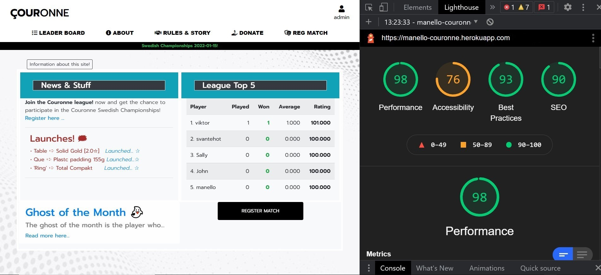

# Testing

[View website on Heroku](https://manello-couronne.herokuapp.com/)

[GO TO README.md](README.md)

## Testing User Stories

### New/Potential User Goals:

1. As a new user, I want to easily navigate through the website to find the relevant content, effortlessly.

   - The navigation is clearly defined and easily navigable for users to find and use.

   - The pages are appropriately named for users wishing to find out about the site.

   - The register match, league pages and the rest of the pages are found easily on each page, no matter the device.
   
2. As a new user, I want to find league pages, tornament and events and register match page.

   - It is easy to find where and how to Log in/Log out and register wherever you are on the site.

3. As a new user, I Want to easily have the ability to get the rules and criteria of the site.

   - The info Modals and info button drop-downs are helps to find what you are looking for.

4. As a new user, I Want to easily have the ability to get to the register match area and start playing couronne games with my friends.

   - The register page can be started directly from the front page in a simple way.

5. As a new user, I want some features on the site:

   - [x] I want to be able to register, Log-in and Log-out.

   - [x] I want to be able to register matches.

   - [x] I want to be able to see the league position.

   - [x] I want to be able to update my profile.

   - [x] I want to be able to get back to the front page.

   - [x] I want to be able to see my results.

   - [x] I want to be able to contact the site.

   - [x] I want to be able to "forget" my password.
   
## Manual Content Testing
The pages on the site works flawlessly in all screen sizes and is self-explanatory.

### Start Page:
#### News & Stuff section/column
- [x] Advertisements to register for users who are not registered are displayed and disappear when the user has registered.

- [x] Information about this site drop-down button
which is displayed to the user has registered three matches, in order to then disappear.

- [x] Launched... ✰  links

- [x] Modal function on lunched links

- [x] Ghost of the Month link

- [x] Ghost of the Month link
#### League Top 5 section/column

- [x] The heading is link to all league

- [x] The info icon hover information

- [x] The user/player hover information

- [x] The Register Match button

### All Players (LEADER BOARD):

- [x] Back, Home, Your Club buttons

### Your Club Result (LEADER BOARD)
- [x] Various heading content depending on whether the user is AnonymusUser, Is a member of any club, or not a member of any club

- [x] Back, Home, Your Club buttons

### About & Info (ABOUT)
- [x] Navigate drop-down button

- [x] Up buttons

- [x] Cheating widget (about your IP, Os, Browser)

- [x] Back, Home buttons

### Contact Us (ABOUT)
- [x] Form for contact us

- [x] Back, Home buttons

### RULES & STORY
- [x] Back, Home buttons

### DONATE
- [x] Donation with webhook, stripe event, mail verification

- [x] Back, Home buttons

### REG MATCH
- [x] Input works with:
   - [x] Input a valid user/player --> Goes to a virfication page with a done button

   - [x] Input nothing --> Goes to a error/information page with a back button

   - [x] Wrong spelling --> Goes to a error/information page with a back button

   - [x] Input nothing --> Goes to a error/information page with a back button

   - [x] Input your own name --> Goes to a error/information page with a back button

   - [x] Input admin --> Goes to a error/information page with a back button

- [x] Users/Players list on the bottom with hover effect

- [x] Back, Home buttons

### My Profile (profile icon in top right)

- [x] Update your Profile button

- [x] Back, Home buttons

### Update (My profile)

- [x] Update Modal (verification)

- [x] Back, Home buttons

- Checked with the browser's built-in responsive tool (inspect).

---

## Automated Testing

### code Validation

- The [RESPONSIVE WEB DESIGN CHECKER](https://responsivedesignchecker.com/) service is used to check how responsive the website is.

- The [W3C CSS Validator](https://jigsaw.w3.org/css-validator/) service was used to validate the CSS code used.

- The [jshint](https://jshint.com/) service was used to validate the JavaScript code used.

- All HTML and CSS pages are formatted using [The formatter](https://www.freeformatter.com/).

- Used [corrector](https://www.corrector.co/) for spell checking.

### CSS Validation

#### Results:

- It´s only one CSS file in the project (style.css)
  - (The test is done from Swedish browser, translated into English: Congratulations! No errors were found)

## Lighthouse

Screenshot from the index page (desktop device)

## User Testing

Family members were asked to review the site and documentation to point out any bugs and/or user experience issues. Their helpful advice throughout the process led to many UX changes to create a better experience.

[Back to the top](#Testing) 
